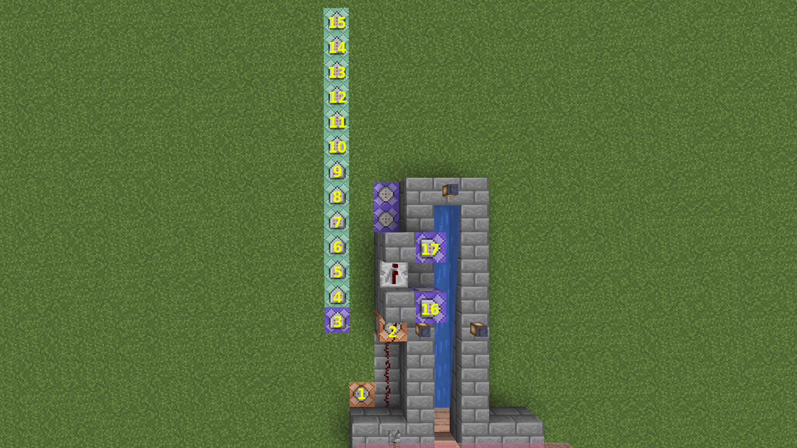

# InstantXP

This small quality-of-life mod makes experience absorption nearly instant while still preserving part of the XP orb animation. InstantXP only changes how quickly orbs are collected: vanilla XP amounts, Mending behavior and orb values remain unchanged, and the mod does not create XP or manually discard orbs.

## Installation

Singleplayer works because Minecraft runs an integrated server inside the client. The XP logic still runs server-side, just within your local game.

For multiplayer, install InstantXP on the server. Players do not need to install the mod on their clients. Installing the mod only on the client will not affect XP behavior on a dedicated server, since XP pickup is handled entirely by the server.

## Absorption Time Benchmark

> This table, measured with Fabric on Minecraft 26.1, estimates XP absorption times in a controlled environment. The test world was originally created for Minecraft 1.21.1 and is available for download [here](https://github.com/javiluli/InstantXP/releases/download/mc1.21.1-1.0.1/test_world.zip).

| XP Level | MC vanilla | InstantXP V2.0 |  Diff  | Reduction |
| -------: | :--------: | :------------: | :----: | :-------: |
|        5 |   00:00    |     00:00      | 00:00  |     —     |
|       10 |   00:01    |     00:00      | -00:01 |  100.00%  |
|       15 |   00:02    |     00:01      | -00:01 |  50.00%   |
|       20 |   00:03    |     00:01      | -00:02 |  66.67%   |
|       25 |   00:05    |     00:01      | -00:04 |  80.00%   |
|       30 |   00:07    |     00:02      | -00:05 |  71.43%   |
|       35 |   00:11    |     00:03      | -00:08 |  72.73%   |
|       40 |   00:15    |     00:04      | -00:11 |  73.33%   |
|       45 |   00:22    |     00:05      | -00:17 |  77.27%   |
|       50 |   00:29    |     00:07      | -00:22 |  75.86%   |
|       55 |   00:38    |     00:09      | -00:29 |  76.32%   |
|       60 |   00:47    |     00:11      | -00:36 |  76.60%   |
|       65 |   00:57    |     00:13      | -00:44 |  77.19%   |
|       70 |   01:10    |     00:16      | -00:54 |  77.14%   |
|       75 |   01:24    |     00:19      | -01:05 |  77.38%   |
|       80 |   01:39    |     00:23      | -01:16 |  76.77%   |
|       85 |   01:54    |     00:26      | -01:28 |  77.19%   |
|       90 |   02:11    |     00:30      | -01:41 |  77.10%   |
|       95 |   02:28    |     00:34      | -01:54 |  77.03%   |
|      100 |   02:47    |     00:39      | -02:08 |  76.65%   |
|      105 |   03:03    |     00:44      | -02:19 |  75.96%   |
|      110 |   03:22    |     00:49      | -02:33 |  75.74%   |
|      115 |   03:49    |     00:54      | -02:55 |  76.42%   |
|      120 |   04:13    |     01:00      | -03:13 |  76.28%   |
|      125 |   04:36    |     01:05      | -03:31 |  76.45%   |
|      130 |   05:02    |     01:12      | -03:50 |  76.16%   |
|      135 |   05:27    |     01:18      | -04:09 |  76.15%   |
|      140 |   05:55    |     01:25      | -04:30 |  76.06%   |
|      145 |   06:24    |     01:32      | -04:52 |  76.04%   |
|      150 |   06:53    |     01:39      | -05:14 |  76.03%   |
|      155 |   07:23    |     01:47      | -05:36 |  75.85%   |
|      160 |   07:56    |     01:54      | -06:02 |  76.05%   |
|      165 |   08:31    |     02:03      | -06:28 |  75.93%   |
|      170 |   09:06    |     02:11      | -06:55 |  76.01%   |
|      175 |   09:43    |     02:20      | -07:23 |  75.99%   |
|      180 |   10:22    |     02:29      | -07:53 |  76.05%   |
|      185 |   11:00    |     02:38      | -08:22 |  76.06%   |
|      190 |   11:41    |     02:47      | -08:54 |  76.18%   |
|      195 |   12:20    |     02:57      | -09:23 |  76.08%   |
|      200 |   13:01    |     03:07      | -09:54 |  76.06%   |
|      205 |   13:45    |     03:18      | -10:27 |  76.00%   |
|      210 |   14:29    |     03:28      | -11:01 |  76.06%   |
|      215 |   15:13    |     03:39      | -11:34 |  76.01%   |
|      220 |   16:00    |     03:50      | -12:10 |  76.04%   |
|      225 |   16:49    |     04:02      | -12:47 |  76.02%   |
|      230 |   17:37    |     04:14      | -13:23 |  75.97%   |
|      235 |   18:26    |     04:26      | -14:00 |  75.95%   |
|      240 |   19:16    |     04:38      | -14:38 |  75.95%   |
|      245 |   20:08    |     04:51      | -15:17 |  75.91%   |
|      250 |   21:02    |     05:04      | -15:58 |  75.91%   |
|      255 |   21:55    |     05:17      | -16:38 |  75.89%   |
|      260 |   22:52    |     05:30      | -17:22 |  75.95%   |
|      265 |   23:50    |     05:44      | -18:06 |  75.94%   |
|      270 |   24:49    |     05:58      | -18:51 |  75.96%   |
|      275 |   25:48    |     06:12      | -19:36 |  75.97%   |
|      280 |   26:46    |     06:27      | -20:19 |  75.90%   |
|      285 |   27:47    |     06:42      | -21:05 |  75.88%   |
|      290 |   28:52    |     06:57      | -21:55 |  75.92%   |
|      295 |   29:55    |     07:12      | -22:43 |  75.93%   |
|      300 |   31:01    |     07:28      | -23:33 |  75.93%   |
|      305 |   32:07    |     07:44      | -24:23 |  75.92%   |
|      310 |   33:15    |     08:00      | -25:15 |  75.94%   |
|      315 |   34:23    |     08:17      | -26:06 |  75.91%   |
|      320 |   35:31    |     08:34      | -26:57 |  75.88%   |
|      325 |   36:43    |     08:51      | -27:52 |  75.90%   |
|      330 |   37:58    |     09:08      | -28:50 |  75.94%   |
|      335 |   39:07    |     09:26      | -29:41 |  75.88%   |
|      340 |   40:20    |     09:44      | -30:36 |  75.87%   |
|      345 |   41:35    |     10:02      | -31:33 |  75.87%   |
|      350 |   42:49    |     10:21      | -32:28 |  75.83%   |
|      355 |   44:06    |     10:40      | -33:26 |  75.81%   |
|      360 |   45:28    |     10:59      | -34:29 |  75.84%   |
|      365 |   46:48    |     11:18      | -35:30 |  75.85%   |
|      370 |   48:08    |     11:38      | -36:30 |  75.83%   |
|      375 |   49:30    |     11:58      | -37:32 |  75.82%   |
|      380 |   50:54    |     12:18      | -38:36 |  75.83%   |
|      385 |   52:19    |     12:38      | -39:41 |  75.85%   |
|      390 |   53:43    |     12:59      | -40:44 |  75.83%   |
|      395 |   55:08    |     13:20      | -41:48 |  75.82%   |
|      400 |   56:37    |     13:42      | -42:55 |  75.80%   |
|      405 |   58:06    |     14:03      | -44:03 |  75.82%   |
|      410 |   59:37    |     14:25      | -45:12 |  75.82%   |
|      415 |   61:07    |     14:47      | -46:20 |  75.81%   |
|      420 |   62:39    |     15:10      | -47:29 |  75.79%   |
|      425 |   64:13    |     15:33      | -48:40 |  75.79%   |
|      430 |   65:48    |     15:56      | -49:52 |  75.79%   |
|      435 |   67:24    |     16:19      | -51:05 |  75.79%   |
|      440 |   69:01    |     16:43      | -52:18 |  75.78%   |
|      445 |   70:41    |     17:06      | -53:35 |  75.81%   |
|      450 |   72:20    |     17:31      | -54:49 |  75.78%   |
|      455 |   73:59    |     17:55      | -56:04 |  75.78%   |
|      460 |   75:42    |     18:20      | -57:22 |  75.78%   |
|      465 |   77:25    |     18:45      | -58:40 |  75.78%   |
|      470 |   79:08    |     19:10      | -59:58 |  75.78%   |
|      475 |   80:55    |     19:36      | -61:19 |  75.78%   |
|      480 |   82:43    |     20:01      | -62:42 |  75.80%   |
|      485 |   84:32    |     20:28      | -64:04 |  75.79%   |
|      490 |   86:25    |     20:54      | -65:31 |  75.81%   |
|      495 |   88:16    |     21:21      | -66:55 |  75.81%   |
|      500 |   90:09    |     21:48      | -68:21 |  75.82%   |

### Command blocks

This section lists the commands used to create the in-game level counter (map available [here](https://github.com/javiluli/InstantXP/releases/download/mc1.21.1-1.0.1/test_world.zip)).

<table>
  <tr>
    <td>#1</td>
    <td><code>/xp set @p 0 points</code></td>
  </tr>
  <tr>
    <td>#2</td>
    <td><code>/xp set @p 0 levels</code></td>
  </tr>
  <tr>
    <td>#3</td>
    <td><code>/scoreboard players add @p tiempo 1</code></td>
  </tr>
  <tr>
    <td>#4</td>
    <td><code>/execute as @p store result score @s nivel run xp query @s levels</code></td>
  </tr>
  <tr>
    <td>#5</td>
    <td><code>/execute as @p if score @s nivel matches 0 run scoreboard players set @s objetivo 5</code></td>
  </tr>
  <tr>
    <td>#6</td>
    <td><code>/execute as @p if score @s nivel matches 0 run scoreboard players set @s tiempo 0</code></td>
  </tr>
  <tr>
    <td>#7</td>
    <td><code>/execute as @p if score @s nivel >= @s objetivo run scoreboard players operation @s temp = @s tiempo</code></td>
  </tr>
  <tr>
    <td>#8</td>
    <td><code>/execute as @p if score @s nivel >= @s objetivo run scoreboard players operation @s temp /= #20 tiempo</code></td>
  </tr>
  <tr>
    <td>#9</td>
    <td><code>/execute as @p if score @s nivel >= @s objetivo run scoreboard players operation @s minutos = @s temp</code></td>
  </tr>
  <tr>
    <td>#10</td>
    <td><code>/execute as @p if score @s nivel >= @s objetivo run scoreboard players operation @s minutos /= #60 tiempo</code></td>
  </tr>
  <tr>
    <td>#11</td>
    <td><code>/execute as @p if score @s nivel >= @s objetivo run scoreboard players operation @s segundos = @s temp</code></td>
  </tr>
  <tr>
    <td>#12</td>
    <td><code>/execute as @p if score @s nivel >= @s objetivo run scoreboard players operation @s segundos %= #60 tiempo</code></td>
  </tr>
  <tr>
    <td>#13</td>
    <td><code>/execute as @p if score @s nivel >= @s objetivo if score @s segundos matches 0..9 run tellraw @s [{"text":"Level "},{"score":{"name":"@s","objective":"objetivo"}},{"text":" reached in "},{"score":{"name":"@s","objective":"minutos"}},{"text":":0"},{"score":{"name":"@s","objective":"segundos"}}]</code></td>
  </tr>
  <tr>
    <td>#14</td>
    <td><code>/execute as @p if score @s nivel >= @s objetivo if score @s segundos matches 10.. run tellraw @s [{"text":"Level "},{"score":{"name":"@s","objective":"objetivo"}},{"text":" reached in "},{"score":{"name":"@s","objective":"minutos"}},{"text":":"},{"score":{"name":"@s","objective":"segundos"}}]</code></td>
  </tr>
  <tr>
    <td>#15</td>
    <td><code>/execute as @p if score @s nivel >= @s objetivo run scoreboard players add @s objetivo 5</code></td>
  </tr>
  <tr>
    <td>#16</td>
    <td><code>/summon experience_orb ~1 ~ ~ {Value:10}</code></td>
  </tr>
  <tr>
    <td>#17</td>
    <td><code>/summon experience_orb ~1 ~ ~ {Value:30}</code></td>
  </tr>
</table>

